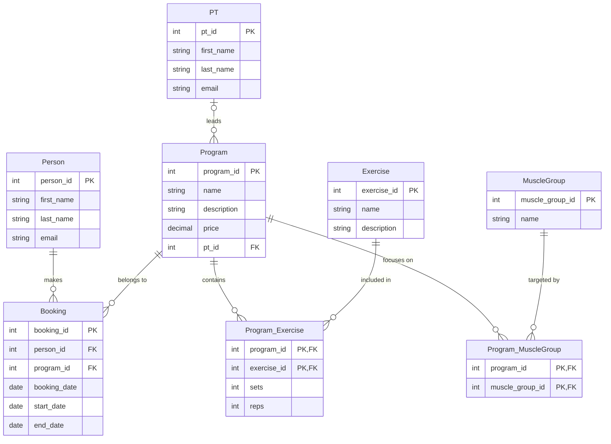

```mermaid
erDiagram
    PT {
        int pt_id PK
        string first_name
        string last_name
        string email
    }
    Person {
        int person_id PK
        string first_name
        string last_name
        string email
    }
    Program {
        int program_id PK
        string name
        string description
        decimal price
        int pt_id FK
    }
    Exercise {
        int exercise_id PK
        string name
        string description
    }
    MuscleGroup {
        int muscle_group_id PK
        string name
    }
    Booking {
        int booking_id PK
        int person_id FK
        int program_id FK
        date booking_date
        date start_date
        date end_date
    }
    Program_Exercise {
        int program_id PK, FK
        int exercise_id PK, FK
        int sets
        int reps
    }
    Program_MuscleGroup {
        int program_id PK, FK
        int muscle_group_id PK, FK
    }

    PT           |o--o{ Program           : "leads"
    Person       ||--o{ Booking           : "makes"
    Program      ||--o{ Booking           : "belongs to"
    Program      ||--o{ Program_Exercise  : "contains"
    Exercise     ||--o{ Program_Exercise  : "included in"
    Program      ||--o{ Program_MuscleGroup : "focuses on"
    MuscleGroup  ||--o{ Program_MuscleGroup : "targeted by"
```
