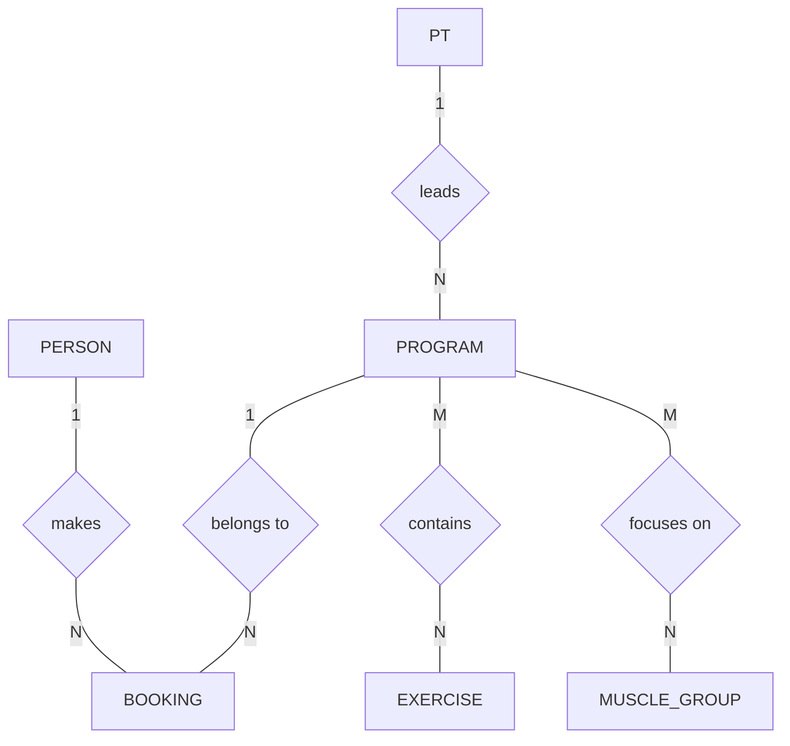

```mermaid
flowchart TD
    PT[PT] -- 1 --- leads{leads} -- N --- PROGRAM[PROGRAM]
    PERSON[PERSON] -- 1 --- makes{makes} -- N --- BOOKING[BOOKING]
    PROGRAM -- 1 --- belongsTo{belongs to} -- N --- BOOKING
    PROGRAM -- M --- contains{contains} -- N --- EXERCISE[EXERCISE]
    PROGRAM -- M --- focusesOn{focuses on} -- N --- MUSCLEGROUP[MUSCLE_GROUP]
```
