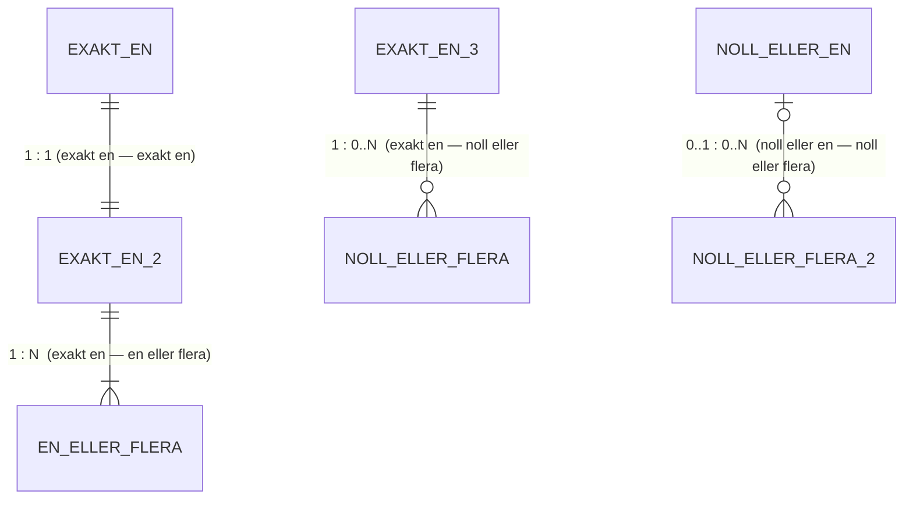

# ER-diagram — Notationsförklaring

## Crow's foot — symboler



---

## Hur man läser crow's foot

Symbolen närmast entiteten beskriver **den** entitetens sida av relationen.

```
PERSON  ||--o{  BOOKING
        ^^  ^^
        ||  o{
        |   Noll eller flera (N) bokningar per person
        Exakt en person per bokning
```

---

## Relationer i detta projekt

| Relation                          | Crow's foot | Text  | Betydelse                                      |
|-----------------------------------|-------------|-------|------------------------------------------------|
| PT → Program                      | `\|\|--o{`  | 1 : N | En PT kan leda noll eller flera program        |
| Person → Booking                  | `\|\|--o{`  | 1 : N | En person kan ha noll eller flera bokningar    |
| Program → Booking                 | `\|\|--o{`  | 1 : N | Ett program kan ha noll eller flera bokningar  |
| Program → Program_Exercise        | `\|\|--o{`  | 1 : N | Ett program har noll eller flera övningsrader  |
| Exercise → Program_Exercise       | `\|\|--o{`  | 1 : N | En övning kan ingå i noll eller flera program  |
| Program → Program_MuscleGroup     | `\|\|--o{`  | 1 : N | Ett program har noll eller flera muskelgrupper |
| MuscleGroup → Program_MuscleGroup | `\|\|--o{`  | 1 : N | En muskelgrupp kan finnas i noll eller flera   |

> **Obs:** Program ↔ Exercise och Program ↔ MuscleGroup är egentligen **M:N**-relationer.
> De bryts ned till två 1:N-relationer via kopplingstabellerna Program_Exercise och Program_MuscleGroup.
